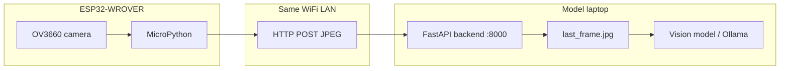

# NomSpot — ESP32 camera + laptop vision backend

Retail-style pipeline: a **Freenove ESP32-WROVER** (OV3660 camera) captures shelf images and sends them over **WiFi** to a **laptop HTTP API**. A **vision model** (e.g. Ollama on that laptop or in a merged repo) runs on each frame to detect objects such as cups or misplacement.

This repo is the **edge + ingest** half. Merge it with your **model** repo by keeping `backend/` as the integration point.

---

## How it works



| Step | Where | What happens |
|------|--------|----------------|
| 1 | ESP32 | Camera firmware captures VGA JPEG (~15–25 KB) |
| 2 | ESP32 | Connects to your WiFi, `POST` to `http://<laptop-ip>:8000/api/frame` every few seconds |
| 3 | Laptop | Saves latest frame as `backend/last_frame.jpg` |
| 4 | Laptop | `detector_ollama.detect_cup()` — **stub today**; wire your model here after merge |

**Important:** `BACKEND_URL` must use the **model laptop’s LAN IP** (from `ipconfig`), not `127.0.0.1`, because the ESP32 is a separate device on the network.

---

## Repository layout

```
NomSpot/
├── README.md                 ← you are here
├── MVP.md                    ← shortest end-to-end checklist
├── PHASE1.md                 ← camera flash + verify
├── firmware/esp32/           ← flash scripts, camera MicroPython .bin (download separately)
├── src/esp32/                ← MicroPython on the board
│   ├── camera_freenove.py    ← Freenove pin map + JPEG capture
│   ├── main.py               ← Phase 1 smoke test
│   ├── main_upload.py        ← Phase 2 WiFi upload loop
│   ├── upload_client.py      ← HTTP POST via socket
│   └── wifi_config.example.py
├── backend/                  ← run on the model laptop
│   ├── app.py                ← POST /api/frame, GET /health, GET /api/status
│   ├── detector_ollama.py    ← hook for your model (stub)
│   └── start_backend.ps1
└── captures/                 ← sample JPEG pulled from ESP32 during Phase 1 test
```

**Not in Git (see `.gitignore`):** `wifi_config.py` (secrets), `*.bin` firmware, `last_frame.jpg`, local captures.

---

## Hardware

- **Board:** Freenove ESP32-WROVER (8 MB PSRAM, CH340 USB-serial)
- **Camera:** OV3660 (same pinout as Freenove docs for OV2640)
- **Firmware:** [lemariva micropython-camera-driver](https://github.com/lemariva/micropython-camera-driver) — stock micropython.org builds have **no** `camera` module

---

## Quick start

### Prerequisites (dev PC)

- Python 3.10+
- USB **data** cable
- [CH340 driver](firmware/esp32/README.md#ch340-driver-usb-serial) if no COM port appears

```powershell
cd firmware\esp32
python -m pip install -r requirements.txt
.\download_firmware.ps1
```

### Phase 1 — Camera over USB

```powershell
cd firmware\esp32
.\test_phase1.ps1 -Port COM4
```

Expect `PASS: 3 frames` and `captures\phase1_sample.jpg`.

### Phase 2 — WiFi to model laptop

**On the model laptop** (receives photos):

```powershell
cd backend
python -m pip install -r requirements.txt
.\start_backend.ps1
```

Note the printed IP (e.g. `192.168.1.50`). Allow **Python** through Windows Firewall on **private** networks for port **8000**.

**On the PC with ESP32 (USB):**

```powershell
cd firmware\esp32
.\prepare_wifi_config.ps1
.\upload_wifi.ps1 -Port COM4
```

Use the **model laptop IP** when prompted for `BACKEND_URL`.

**Verify:** `backend\last_frame.jpg` on the model laptop updates every ~2 s; serial shows `POST status: 200`.

More detail: [MVP.md](MVP.md) · [SETUP.md](SETUP.md) · [PHASE1.md](PHASE1.md)

---

## Handoff: what the other person does on their laptop

Use this when someone else is taking over and needs to connect to your ESP32 camera feed.

### 1) Clone and run backend on their laptop

```powershell
git clone <repo-url>
cd Cursor\backend
python -m pip install -r requirements.txt
.\start_backend.ps1
```

They should see:

- `NomSpot backend starting on http://0.0.0.0:8000`
- `ESP32 BACKEND_URL should use: http://<their-ip>:8000/api/frame`

### 2) Open firewall on their laptop

- Allow Python/uvicorn on **Private** networks.
- Confirm from browser on their laptop:
  - `http://127.0.0.1:8000/health` -> `{"status":"ok"}`

### 3) Send ESP32 frames to their laptop

On the machine with ESP32 over USB:

```powershell
cd firmware\esp32
.\prepare_wifi_config.ps1
.\upload_wifi.ps1 -Port COM4
```

When prompted, enter:

- WiFi SSID/password used by ESP32
- **Their laptop IP** from `start_backend.ps1` or `ipconfig`

### 4) Verify end-to-end

- ESP32 serial output: `POST status: 200`
- Their laptop: `backend\last_frame.jpg` keeps updating
- Optional API check: `http://<their-ip>:8000/api/status`

### 5) Push from their laptop (if they are the one committing)

```powershell
cd Cursor
git checkout -b Roryv1camera
git add .
git commit -m "feat: ESP32 WiFi camera ingest MVP"
git push -u origin Roryv1camera
```

If they are merging into another repo with model code, follow [MERGE_WITH_MODEL.md](MERGE_WITH_MODEL.md).

---

## Connecting this repo to your model repo

This repo stops at **receiving JPEGs** and a **stub** detector. Your other repo likely has the real model (Ollama, PyTorch, etc.).

### Recommended merge approach

1. **Keep** `backend/app.py` as the HTTP entry point (`POST /api/frame`).
2. **Replace or extend** `backend/detector_ollama.py` with your model code, e.g.:

   ```python
   def detect_cup(jpeg_bytes: bytes) -> dict:
       # Call your existing model inference here
       return {"cup_present": True, "confidence": 0.92, ...}
   ```

3. **Run one backend** on the model laptop — do not run two servers on port 8000.
4. **ESP32 config unchanged** — still posts to `http://<model-laptop-ip>:8000/api/frame`.

### API contract (for your model repo)

| Endpoint | Method | Body | Response |
|----------|--------|------|----------|
| `/health` | GET | — | `{"status":"ok"}` |
| `/api/frame` | POST | raw JPEG, `Content-Type: image/jpeg` | `{"ok":true,"bytes":N,"detection":{...}}` |
| `/api/status` | GET | — | last frame size + last `detection` dict |

### Git — push to `Roryv1camera` on GitHub

Local repo is initialized with branch **`Roryv1camera`** and an initial commit.

**One-time login** (GitHub CLI):

```powershell
gh auth login
```

**Create repo and push** (new repo named `Roryv1camera`):

```powershell
cd "c:\Users\Rory Tuke\NomSpot\Cursor"
gh repo create Roryv1camera --private --source=. --remote=origin --push
```

**Or push to an existing repo** (e.g. `Cursor-Perish-Hack` as branch `Roryv1camera`):

```powershell
.\scripts\push_roryv1camera.ps1 -RemoteUrl https://github.com/YOUR_USER/Cursor-Perish-Hack.git
```

See [MERGE_WITH_MODEL.md](MERGE_WITH_MODEL.md) for combining with your model codebase.

**Merge with model repo:**

```powershell
# Option A: model repo is the main remote — add this as a branch
git remote add nomspot-edge <this-repo-url>
git fetch nomspot-edge
git checkout -b feature/esp32-camera nomspot-edge/main
# resolve conflicts in backend/ only, then PR into model repo

# Option B: copy folders into model monorepo
#   firmware/esp32/  src/esp32/  backend/app.py  backend/detector_ollama.py
```

Put ESP32 code under e.g. `edge/esp32/` in a monorepo if you prefer; update paths in scripts accordingly.

---

## Boot behavior on the ESP32

| File on device | Behavior |
|----------------|----------|
| No `wifi_config.py` | `boot.py` → `main.py` Phase 1 smoke test |
| `wifi_config.py` present | `boot.py` → `main_upload.py` WiFi loop (no smoke test) |

To go back to USB-only testing, delete `wifi_config.py` on the board and reset.

---

## Troubleshooting

| Symptom | Fix |
|---------|-----|
| No COM port | CH340 driver, data cable, Device Manager |
| COM port busy | Close Thonny / serial monitors |
| `camera.init` fails | Reseat ribbon; reflash `.\setup.ps1 -Port COMx` |
| `POST status: None` | Wrong laptop IP, backend not running, or firewall |
| WiFi timeout | Check SSID/password; try 2.4 GHz network |
| Empty JPEG | See [PHASE1.md](PHASE1.md) Path B firmware note for OV3660 |

---

## License / docs

- Freenove camera pins: [Freenove Camera Web Server](https://docs.freenove.com/projects/fnk0060/en/latest/fnk0060/codes/Python/30_Camera_Web_Server.html)
- Agent notes for Cursor: [AGENTS.md](AGENTS.md)
