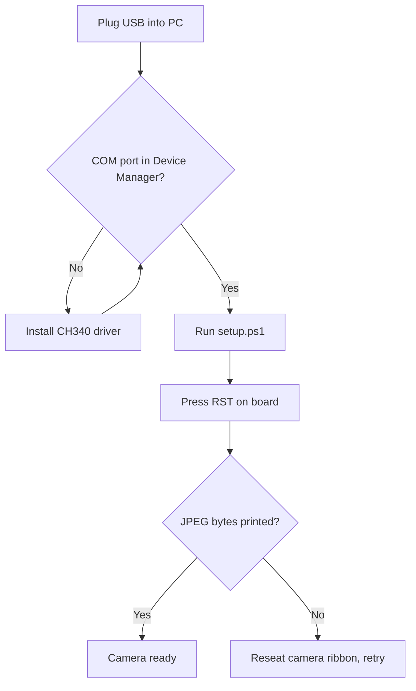

# NomSpot ESP32 camera — setup for you

**Phase 1:** [PHASE1.md](PHASE1.md) — `firmware\esp32\test_phase1.ps1`

**MVP (ESP32 → WiFi → model laptop):** [MVP.md](MVP.md)

## What was done in the repo

- Downloaded **camera-enabled MicroPython** firmware (~1.4 MB) to `firmware/esp32/micropython_camera.bin`
- Added flash/upload scripts and ESP32 MicroPython source (`src/esp32/`)
- Installed **esptool** and **mpremote** on your PC (via pip)
- **Phase 2:** `upload_client.py`, `main_upload.py`, laptop `backend/` (FastAPI)
- **Phase 3 stub:** `backend/detector_ollama.py` (placeholder; Ollama not wired)

## What you need on the PC (libraries)

### ESP32 flash / serial

```powershell
cd "c:\Users\Rory Tuke\NomSpot\Cursor\firmware\esp32"
python -m pip install -r requirements.txt
```

| Tool | Purpose |
|------|---------|
| **esptool** | Flash firmware to ESP32 |
| **mpremote** | Upload `.py` files and read serial output |

### Laptop backend (Phase 2)

```powershell
cd "c:\Users\Rory Tuke\NomSpot\Cursor\backend"
python -m pip install -r requirements.txt
python -m uvicorn app:app --host 0.0.0.0 --port 8000
```

See `backend/README.md` for firewall and `ipconfig` notes.

**Windows driver:** If no COM port appears, install the **CH340** USB-serial driver for Freenove boards.

## What runs on the ESP32 (not pip — copied to the board)

| File | Role |
|------|------|
| `micropython_camera.bin` | Firmware with built-in `camera` module |
| `boot.py` | GC on boot; starts Phase 2 upload if `wifi_config.py` exists |
| `camera_freenove.py` | Camera init with correct pins + PSRAM |
| `main.py` | Phase 1 smoke test (3 JPEGs, print sizes) |
| `main_upload.py` | Phase 2 loop: WiFi + capture + POST |
| `upload_client.py` | HTTP POST helper (`urequests`) |
| `wifi_config.py` | **On device only** — copy from `wifi_config.example.py` |

No `lib/` folder is required for smoke test or WiFi upload.

## Phase 1 — Boot the board and smoke test



1. Plug in the ESP32-WROVER with a **data** USB cable.
2. Open **Device Manager** → **Ports** → note **COM** number (e.g. COM4).
3. Run full setup:

```powershell
cd "c:\Users\Rory Tuke\NomSpot\Cursor\firmware\esp32"
.\setup.ps1 -Port COM4
```

4. When flashing finishes, press **RST** once.
5. Success looks like:

```
Camera init OK
JPEG bytes: 15000
...
Done.
```

**Do not** connect GPIO0 to GND unless `esptool` cannot connect.

## Phase 2 — WiFi JPEG upload to laptop

1. **Laptop IP** — same WiFi as the ESP32 (2.4 GHz):

   ```powershell
   ipconfig
   ```

   Use **Wireless LAN adapter Wi-Fi** IPv4 (e.g. `192.168.6.219`).

2. **Backend** — allow Python on private networks (Windows Firewall):

   ```powershell
   cd "c:\Users\Rory Tuke\NomSpot\Cursor\backend"
   python -m pip install -r requirements.txt
   python -m uvicorn app:app --host 0.0.0.0 --port 8000
   ```

   Verify: `curl http://127.0.0.1:8000/health` → `{"status":"ok"}`

3. **WiFi config** — copy example and edit SSID, password, and `BACKEND_URL`:

   ```powershell
   copy "src\esp32\wifi_config.example.py" "src\esp32\wifi_config.py"
   ```

   Set `BACKEND_URL = "http://YOUR_LAN_IP:8000/api/frame"` (not `127.0.0.1` — the ESP32 must reach the laptop on the LAN).

4. **Upload to board**:

   ```powershell
   cd "c:\Users\Rory Tuke\NomSpot\Cursor\firmware\esp32"
   .\upload.ps1 -Port COM4
   python -m mpremote connect COM4 fs cp "..\..\src\esp32\wifi_config.py" :wifi_config.py
   python -m mpremote connect COM4 reset
   ```

5. **Success** — serial shows `WiFi OK`, then `POST status: 200` every ~2 s. `backend/last_frame.jpg` updates on the laptop.

**Notes:** `upload_client.py` uses raw `socket` HTTP (lemariva firmware has no `urequests`). If Phase 2 fails on boot and mpremote cannot connect, run `python recover_upload.py` from `firmware/esp32/`.

To return to Phase 1 only, delete `wifi_config.py` on the board and reset.

## If setup says “No serial port found”

- Unplug/replug USB, try another port/cable
- Install CH340 driver (`firmware/esp32/drivers/` or manufacturer site)
- Close Thonny or other apps using the COM port
- Run: `.\setup.ps1 -Port COMx` with the correct number

## Phase 3 (later)

- Wire `backend/detector_ollama.py` to Ollama vision
- `GET /api/status` already returns the last stub detection

See `AGENTS.md` for agent constraints.
